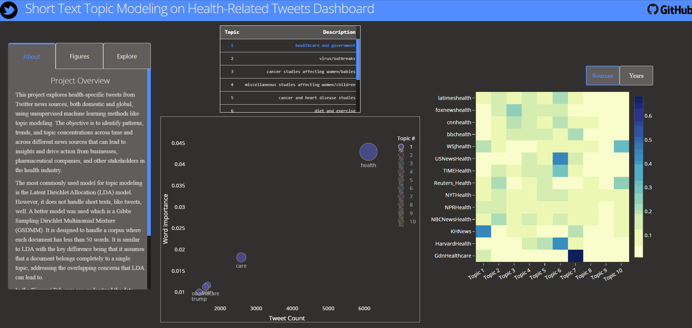

# Health Tweets Exploration Using Topic Modeling & Sentiment Analysis

This project explores health-related tweets using machine learning techniques such as topic modeling, clustering, and sentiment analysis. It covers tweets scraped from January 1, 2014 - March 28, 2020 from 14 various health-specific news twitter accounts (i.e @cnnhealth, @foxnewshealth, @harvardhealth, etc). The project was completed in Python and there and an interactive dashboard was created using a Dash - Python framework developed by [Plotly](https://plot.ly/dash). 
* The dashboard was deployed on Heroku here: https://health-tweets-topics.herokuapp.com/

## Using the dashboard
To get started, choose the preset number of topics you would like to explore to refresh the dashboard's current model results. Then, you can start interacting with each topic words distribution in the bubble chart as well as the distribution of those topics across news sources and years with the heatmap.

## Data Overview
### Data Scraping & Cleaning
Tweets were scraped using [Twint](https://github.com/twintproject/twint), an advanced Twitter scraping tool that doesn't use the Twitter API. Over 200k tweets were scraped from the following Twitter News Sources:
* BBC Health 
* CNN Health 
* Fox News Health 
* Guardian Healthcare
* Harvard Health
* Kaiser Health News
* LA Times Health
* NBC News Health
* NPR Health News 
* NYT Health
* Reuters Health
* TIME Health 
* US News Health
* WSJ Health News

Each tweet was then pre-processed, cleaned, and tokenized using lemmatization. The resulting selected features for each tweet were: *id, date, timezone, tweet, hashtags, username, name, day, hour, retweet, nlikes, nreplies, nretweets, and clean_tweet*.

### Exploratory Analysis
Once cleaned, exploratory data analysis (EDA) was performed to understand the distribution of the data across news sources, time, etc. 
Highlights include the computation of average words in tweet for each news source, daily tweet counts over time, word cloud of most common words, and most frequent bi-grams. 

## Machine Learning Models
### Topic Modeling
Two models were used for topic modeling:
1. **Latent Dirichilet Allocation (LDA)**
2. **Gibbs Sampling Dirichlet Multinomial Mixture (GSDMM)**

For LDA modeling, both [sklearn](https://scikit-learn.org/stable/modules/generated/sklearn.decomposition.LatentDirichletAllocation.html) and [gensim](https://radimrehurek.com/gensim/models/ldamodel.html) packagess were used to compare results. They seemed to produce similar results with sklearn's package having slightly more human interpretable topics. Topic coherence scores were computed iteratively to determine the number of topics (k) to use in the best model which was determined to be roughly **10 topics**. The model results for 10 topics were visualized using  dimensionality reduction techniques such as t-distributed stochastic neighbor embedding([t-sne](https://lvdmaaten.github.io/tsne/)).

To better handle short texts such as tweets, the [GSDMM model](https://github.com/rwalk/gsdmm) was used which was built based on the [original research paper](http://dbgroup.cs.tsinghua.edu.cn/wangjy/papers/KDD14-GSDMM.pdf) on short-term text modeling (STTM) by Jianhua Yin and Jianyong Wang from Tsinghua University GSDMM is a dirichilet mixture model that assumes each document in a corpus belongs to one topic as compared to simple LDA and it often helps reduce overlap and increase precision for documents like tweets with less than 50 words. *Note: only results from STTM model were used in the interactive dashboard*

### Sentiment Analysis
Sentiment Analysis was performed using NLP modules from [TextBlob](https://textblob.readthedocs.io/en/dev/quickstart.html#sentiment-analysis). Specifically, each tweet was analyzed and scored on two measures as such:
1. **Polarity**: The polarity is a value within the range [-1.0, 1.0] where -1.0 has very negative sentiment and 1.0 has very postive sentiment.
2. **Subjectivity**: The subjectivity is a value within the range [0.0, 1.0] where 0.0 is very objective and 1.0 is very subjective.

## Files and Folders
**Dashboard**
- `app.py` fully defines the Python Dash application with any front-end CSS styling located in the `assets` directory
- Data needed for the dashboard is stored in `data` directory and requirements for the app in `requirements.txt`
- `Procfile` is needed for Heroku deployment. It instructs the linux containerized environment on how to start the app.
- `merge_sttm_results.py`is script used to merge multiple model results into one dataset for use in dashboard interactions

**Models & Analysis**
- All topic models, sentiment analysis, and EDA is located in Jupyter notebooks in the `notebooks` directory
- `pyLDAvis` directory holds all the gensim model visualization results in corresponding HTML files. You must download and run these locally to view. 
- `gsdmm` directory was forked and holds all files and doucmentation needed to run STTM model 

**Other Miscellaneous Files**
- An example of the Twint scraper usage is located in the `twitter_scraper.ipynb` notebook 
- `preprocessor.py` is script responsible for merging multiple csvs scraped into one
- `notebooks/clean_tokenizer.py` is script responsible for cleaning tweet data and tokenizing it

## Other Resources
For a more detailed walkthrough of applying STTM to your own set of data - check out my [tutorial repository](https://github.com/bicachu/short-text-topic-modeling-tutorial) as well as the [series of articles/blog posts](https://medium.com/towards-artificial-intelligence/tweet-topic-modeling-using-twint-to-scrape-tweets-part-1-a9274e5199d2) I published.
